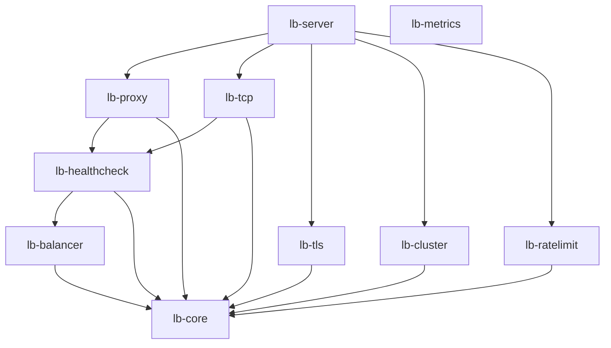

# Architecture

The system is organized into a single binary and ten narrow libraries. The request path stays entirely within the data plane crates, while configuration, clustering, and health checks run in the background.

## Crate Map

| Crate | Role | Key types |
|---|---|---|
| **lb-core** | Shared trait definitions, types, and configuration | `Config`, `Backend`, `BackendPool`, `LoadBalancer`, `RateLimiter`, `HealthProbe`, `Clock`, `ClusterCoordinator`, `OutboundTransport`, `ProbeClient` |
| **lb-server** | Binary entry point, component wiring, accept loop | `ListenerRuntime`, `WiredApp`, `ConnectionLimits`, `ClusterSetup` |
| **lb-proxy** | L7 HTTP forwarding | `ProxyContext`, `ProxyClient`, `AccessLog`, `PinnedResolver` |
| **lb-tcp** | L4 TCP session proxying | `TcpContext`, `ConnectionOutcome` |
| **lb-balancer** | Load-balancing algorithms | `RoundRobin` |
| **lb-ratelimit** | Per-key rate limiter | `Gcra`, `GcraConfig` |
| **lb-healthcheck** | Active health checks, circuit breaker | `HttpProbe`, `TcpConnectProbe`, `CircuitBreaker`, `CircuitState` |
| **lb-cluster** | Distributed rate limiting via CRDT | `ClusterNode`, `ListenerCoordinator`, `CounterStore`, `SyncMessage` |
| **lb-tls** | TLS termination and backend re-encryption | `TlsAcceptor`, `BackendConnector`, `BackendTlsTransport`, `SniResolver` |
| **lb-metrics** | Prometheus metrics and admin server | `Metrics`, `ListenerMetrics`, `BackendMetrics` |
| **lb-bench** | Micro-benchmarks | (binary) |

## Dependency Graph



Dependencies flow strictly downward. `lb-core` depends on nothing inside the workspace. The data-plane crates (`lb-proxy`, `lb-tcp`) depend on `lb-core` and `lb-healthcheck`, but never on each other.

The data-plane crates do not depend on `lb-tls`. `lb-tcp` does not have `rustls` in its dependency tree. It receives an `Arc<dyn OutboundTransport>` from the wiring layer and pumps whatever stream it gets back. `lb-proxy` receives a pre-built `hyper_util::Client` with TLS configuration already applied.

`lb-server` knows all the concrete types. It wires `Gcra<SystemClock>`, `RoundRobin`, `ClusterNode<SystemClock>`, and `BackendTlsTransport` into contexts and hands them to the data plane as trait objects.

`lb-metrics` provides the `Metrics` registry and handles. Consumer crates receive resolved handles from the wiring layer.

## Trait Boundaries

Trait-object boundaries allow crates to consume functionality without linking to the implementations.

### LoadBalancer

```rust
pub trait LoadBalancer: Send + Sync {
    fn pick(&self, pool: &BackendPool) -> Option<BackendId>;
}
```
Implemented by `RoundRobin` in `lb-balancer`. The data plane calls `pick()` on a trait object.

### RateLimiter

```rust
pub trait RateLimiter: Send + Sync {
    fn check(&self, key: &str) -> Decision;
}
```
Implemented by `Gcra` in `lb-ratelimit`. Returns `Allow` or `Deny { retry_after }`.

### HealthProbe

```rust
pub trait HealthProbe: Send + Sync {
    fn probe(&self, backend: &Backend) -> impl Future<Output = bool> + Send;
}
```
Implemented by `HttpProbe` and `TcpConnectProbe` in `lb-healthcheck`. The checker loop calls `probe()` on an interval and writes the result to the pool.

### ClusterCoordinator

```rust
pub trait ClusterCoordinator: Send + Sync {
    fn try_admit(&self, key: &str) -> bool;
}
```
Implemented by `ListenerCoordinator` in `lb-cluster`. Consulted after the local rate limiter allows the request.

### OutboundTransport

```rust
pub trait OutboundTransport: Send + Sync {
    fn wrap(&self, stream: Box<dyn ProxyStream>, server_name: String, timeout: Duration)
        -> WrapFuture<'_>;
}
```
Implemented by `BackendTlsTransport` in `lb-tls`. The L4 data plane asks for a connection to be wrapped without needing a TLS stack.

### ProbeClient

```rust
pub trait ProbeClient: Send + Sync {
    fn get(&self, backend: &Backend, path: &str, backend_tls: bool, timeout: Duration)
        -> ProbeFuture<'_>;
}
```
Implemented by `ProbeCapableClient` in `lb-proxy`. Lets `lb-healthcheck` probe over the data plane's own transport without a dependency cycle.

### Clock

```rust
pub trait Clock: Send + Sync {
    fn now(&self) -> Instant;
    fn unix_secs(&self) -> u64;
}
```
`SystemClock` handles production time. `FakeClock` (under the `test-util` feature) advances only when told, keeping time-dependent tests deterministic.

## Wiring

`build_app` runs once at startup before any port is bound. It assembles the system:

1. Builds TLS acceptors for listeners with `[listeners.tls]`. A bad certificate fails startup.
2. Creates the `Metrics` registry. Metric handles are resolved per-listener and per-backend.
3. Builds backend connectors for listeners with `[listeners.backend_tls]`.
4. Creates the cluster node if `[cluster]` is configured.
5. For each listener:
   - Builds the `BackendPool` and per-backend `CircuitBreaker` map.
   - Creates the `Gcra` rate limiter and spawns its sweeper task.
   - Spawns the TLS certificate reloader.
   - Creates the `ListenerCoordinator` (deriving the limit from rate × window).
   - For HTTP: builds a `hyper_util::Client`, wraps it in `ProbeCapableClient`, and passes both to the proxy context. Spawns health checkers using the same client.
   - For TCP: builds `Arc<dyn OutboundTransport>`, passes it to the TCP context and `TcpConnectProbe`. Spawns health checkers.
   - Constructs the `ListenerRuntime`.

Sharing transport objects between the data plane and health probes guarantees probe fidelity. A backend whose certificate fails verification is marked unhealthy because the probe uses the data plane's exact TLS stack.

## Accept Loop

`serve_listener` runs one accept loop per listener:

1. Acquires a global semaphore permit before calling `accept()`. At capacity, the kernel refuses connections instead of the process spending file descriptors on connections it will immediately discard.
2. Accepts the connection. Transient errors (like fd exhaustion) are logged; the listener stays alive.
3. Checks the per-IP limit. Rejections drop the socket immediately.
4. Spawns the connection task. The limit guards move into the task and release when it drops.
5. Runs the TLS handshake (if applicable) inside the spawned task. A slow handshake stalls one connection, not the accept loop. The limit guards are held, so a handshake flood consumes the budget until timeouts fire.
6. Calls `drive()`, matching on the `ListenerRuntime` to run HTTP or TCP handling.

## Shutdown

`wait_for_shutdown_signal` listens for SIGTERM, SIGINT, or Ctrl+C. A signal broadcasts to all accept loops via a `watch::channel`.

Each loop stops accepting and waits for in-flight connections to complete, up to `drain_timeout_ms`. Connections exceeding the deadline are aborted. Background tasks (sweepers, checkers, sync, reloaders) are aborted after listeners drain.
