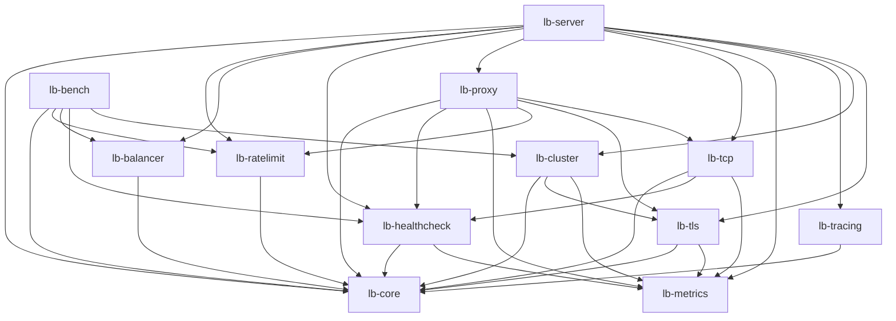

# Architecture

This page describes the workspace's crate structure, the trait boundaries that let the data plane, health checking, and cluster coordination evolve independently, how `lb-server` wires concrete types together at startup, the concurrency model behind the backend pool and circuit breaker, and where to add a strategy, a probe, or a metric. For what happens to one request, see [request-lifecycle.md](request-lifecycle.md); for configuration syntax, see [configuration-reference.md](configuration-reference.md).

## Crate graph

The workspace has 12 members: 11 libraries plus the `lb-server` binary crate. Responsibilities:

| Crate | Responsibility |
|---|---|
| [`lb-core`](../crates/lb-core) | Defines the trait boundaries (`LoadBalancer`, `RateLimiter`, `HealthProbe`, `Clock`, `ClusterCoordinator`, `Resolve`, `OutboundTransport`, `ProbeClient`), the domain types (`Backend`, `BackendId`, `BackendPool`), and the `Config` schema/TOML parsing. Depends on nothing else in the workspace. |
| [`lb-metrics`](../crates/lb-metrics) | The Prometheus metric registry (`Metrics`, `ListenerMetrics`, `BackendMetrics`) and the admin HTTP server (`spawn_admin_server`, `AdminExtension`) that serves `/metrics`, readiness, and backend drain/undrain. Also depends on nothing else in the workspace. |
| [`lb-balancer`](../crates/lb-balancer) | The load-balancing strategy implementations — `RoundRobin`, `LeastConnections`, `WeightedRoundRobin`, `ConsistentHash`, `PeakEwmaP2c` — each implementing `lb_core::LoadBalancer`. Depends only on `lb-core`. |
| [`lb-ratelimit`](../crates/lb-ratelimit) | The GCRA rate limiter (`Gcra`, `GcraConfig`) implementing `lb_core::RateLimiter`, plus its background sweeper that evicts stale keys from its `DashMap`. Depends only on `lb-core`. |
| [`lb-tracing`](../crates/lb-tracing) | Structured/JSON logging and OpenTelemetry OTLP span export setup. Depends only on `lb-core` (for `TracingConfig`). |
| [`lb-healthcheck`](../crates/lb-healthcheck) | Active health checking (`spawn_active_checker`, `HttpProbe`, `TcpConnectProbe`), the lock-free `CircuitBreaker`, and outlier detection (`OutlierDetector`). Built entirely on `lb-core`'s `ProbeClient`/`OutboundTransport`/`HealthProbe` seams. Depends only on `lb-core` and `lb-metrics` — deliberately not on `lb-tls` or `lb-proxy`, so it never runs a second TLS stack with its own trust roots. |
| [`lb-tls`](../crates/lb-tls) | TLS termination (`TlsAcceptor`, SNI certificate resolution, ACME) and backend-facing TLS (`BackendConnector`, `BackendTlsTransport`, which implements `OutboundTransport`), plus certificate hot-reload. Depends on `lb-core` and `lb-metrics`. |
| [`lb-tcp`](../crates/lb-tcp) | The L4 TCP data plane (`handle_connection`, `TcpContext`). Generic over `OutboundTransport`, so it never links against `rustls` directly. Depends on `lb-core`, `lb-healthcheck`, `lb-metrics`. |
| [`lb-cluster`](../crates/lb-cluster) | Cross-node coordination: gossip/CRDT counter sync (`ClusterNode`, `CounterStore`) so several instances share rate-limit state without a central store, and `ListenerCoordinator`, which implements `ClusterCoordinator`. Depends on `lb-core`, `lb-tls` (peer TLS), `lb-metrics`. |
| [`lb-proxy`](../crates/lb-proxy) | The L7 HTTP data plane: forwarding, routing, canary pools, sticky sessions, response caching, WAF header inspection, retry budgets, and WebSocket/Upgrade proxying. The crate with the largest internal dependency footprint: `lb-core`, `lb-healthcheck`, `lb-metrics`, `lb-ratelimit`, `lb-tls`, and `lb-tcp` (reused for the post-upgrade byte pump). |
| [`lb-server`](../crates/lb-server) | The binary crate. Wires every other crate's concrete types together ([`wiring.rs`](../crates/lb-server/src/wiring.rs)), runs the accept loops, the admin extension, config hot-reload over SIGHUP, and graceful shutdown. Depends on every library crate except `lb-bench`. Nothing depends on `lb-server`. |
| [`lb-bench`](../crates/lb-bench) | Load-testing binaries (`lb-bench`, `lb-bench-e2e`, `lb-bench-cluster`, `lb-bench-h2-stress`) used to drive the load balancer and its cluster coordination under load. Depends directly on `lb-core`, `lb-ratelimit`, `lb-balancer`, `lb-healthcheck`, `lb-cluster`, plus its own `hyper`/`rustls`/`h2` stack. Not part of the production dependency graph: it does not depend on `lb-server`, `lb-proxy`, `lb-tcp`, or `lb-tls`, and nothing depends on it. |

### Dependency direction rules

These are enforced by each crate's `Cargo.toml`, not by convention:

- **`lb-core` and `lb-metrics` are the foundation.** Neither depends on any other workspace crate, so both can be depended on from anywhere without pulling in domain or transport concerns.
- **`lb-healthcheck` depends only on `lb-core` + `lb-metrics`.** It has no HTTP client and no TLS crate of its own; it probes through the *same* `ProbeClient`/`OutboundTransport` the data plane forwards through, so a backend whose certificate fails verification probes unhealthy instead of quietly using a different trust store.
- **`lb-tcp` has no TLS dependency.** It depends on `lb-core`, `lb-healthcheck`, `lb-metrics`, but not `lb-tls`, and receives TLS only as a trait object (`Arc<dyn OutboundTransport>`) built elsewhere.
- **`lb-proxy` depends on `lb-tcp`, never the reverse.** `lb-proxy` reuses `lb-tcp`'s byte-pump for the WebSocket/Upgrade backend leg; the edge is one-directional so no cycle exists.
- **`lb-cluster` is independent of the data plane.** It depends on `lb-core`, `lb-tls` (for peer-channel TLS), and `lb-metrics`, but not on `lb-proxy`, `lb-tcp`, `lb-balancer`, `lb-ratelimit`, or `lb-healthcheck`.
- **`lb-balancer` and `lb-ratelimit` depend only on `lb-core`.** Both are pure algorithm crates with no I/O of their own.
- **`lb-server` is the composition root.** It is the only crate permitted to depend on (nearly) everything, and nothing depends on it.

### Dependency diagram

## Core trait boundaries (`lb-core`)

`lb-core` defines every seam the data plane, health checker, and cluster coordinator are built against, so each concrete implementation can live in its own crate and be swapped without touching the callers. Traits used through `Arc<dyn Trait>` are object-safe; `HealthProbe` and `Resolve` are used generically (`fn f<P: HealthProbe>(...)`) because their async methods return `impl Future`, which is not object-safe.

| Trait | File | Signature (essentials) | Why it exists |
|---|---|---|---|
| `LoadBalancer` | [`balancer.rs`](../crates/lb-core/src/balancer.rs) | `pick(&self, pool: &BackendPool, key: &str) -> Option<BackendId>`; `record_latency(&self, id, latency)` defaults to a no-op | Lets `lb-server` swap strategies (round robin, least connections, weighted, consistent hash, peak-EWMA P2C) without the data plane knowing which one is active. `key` is the caller's existing rate-limit identity (source IP or header), reused as the sticky-routing key so listeners configure identity once. `record_latency` is called unconditionally after every attempt; only `PeakEwmaP2c` overrides it. |
| `RateLimiter` | [`ratelimit.rs`](../crates/lb-core/src/ratelimit.rs) | `check(&self, key: &str) -> Decision` where `Decision` is `Allow` or `Deny { retry_after }` | Decouples the data plane from the GCRA implementation in `lb-ratelimit`. |
| `HealthProbe` | [`health.rs`](../crates/lb-core/src/health.rs) | `probe(&self, backend: &Backend) -> impl Future<Output = bool> + Send` | Lets `HttpProbe` and `TcpConnectProbe` (`lb-healthcheck`) define "alive" per protocol; the active-checker loop only schedules the call. |
| `Clock` | [`clock.rs`](../crates/lb-core/src/clock.rs) | `now(&self) -> Instant`; `unix_secs(&self) -> u64` | Everything time-dependent (GCRA, the circuit breaker, cluster bucket alignment) is generic over `Clock`. `SystemClock` is real time; `test_util::FakeClock` (behind the `test-util` feature) only advances when told, making time-based tests deterministic without `tokio::time::sleep`. |
| `ClusterCoordinator` | [`cluster.rs`](../crates/lb-core/src/cluster.rs) | `try_admit(&self, key: &str) -> bool` | Cluster-wide admission, consulted *after* the node-local `RateLimiter` already allowed a request. Implementations must not perform I/O on this path — coordination happens out of band via gossip. |
| `Resolve` | [`resolve.rs`](../crates/lb-core/src/resolve.rs) | `resolve(&self, host: &str, port: u16) -> impl Future<Output = io::Result<Vec<SocketAddr>>> + Send` | Abstracts DNS discovery (`[listeners.dns_discovery]`) behind a seam that a test can fake. |
| `OutboundTransport` | [`transport.rs`](../crates/lb-core/src/transport.rs) | `wrap(&self, stream: Box<dyn ProxyStream>, server_name: String, timeout: Duration) -> WrapFuture<'_>` | The reason `lb-tcp` never learns what `rustls` is: the L4 data plane sees only this trait object; `lb-tls`'s `BackendTlsTransport` supplies the real TLS handshake. |
| `ProbeClient` | [`transport.rs`](../crates/lb-core/src/transport.rs) | `get(&self, backend: &Backend, path: &str, backend_tls: bool, timeout: Duration) -> ProbeFuture<'_>` | The L7 counterpart of `OutboundTransport`: lets `lb-healthcheck` issue a probe through the data plane's own HTTP client (same connection pool, trust roots, and verification policy) while depending on nothing but `lb-core`. Implemented by `ProbeCapableClient` in `lb-proxy`. |
| `ProxyStream` | [`transport.rs`](../crates/lb-core/src/transport.rs) | Blanket impl over any `AsyncRead + AsyncWrite + Unpin + Send + 'static` | Lets a plain `TcpStream` and a TLS stream both qualify as something the L4 data plane can pump, without either crate naming the other. |

`BackendPool` (also in `lb-core`, see [Concurrency model](#concurrency-model)) is the shared state every strategy, health checker, and admin endpoint reads and mutates.

## Wiring

`lb-server`'s [`wiring.rs`](../crates/lb-server/src/wiring.rs) is the one place that knows every concrete type — `Gcra<SystemClock>`, `RoundRobin`/`LeastConnections`/`WeightedRoundRobin`/`ConsistentHash`/`PeakEwmaP2c`, `ClusterNode<SystemClock>`, `BackendTlsTransport`, `CircuitBreaker<SystemClock>` — and hands the data plane only the trait objects and generic contexts (`ProxyContext<Gcra<SystemClock>, SystemClock>`, `TcpContext<Gcra<SystemClock>, SystemClock>`) built from them. `build_app` (called once from [`lib.rs`](../crates/lb-server/src/lib.rs)'s `run`) does this in a fixed order so that anything fallible — a bad certificate, an unreadable CA file — fails startup before any task is spawned or any port is bound:

1. Build every listener's TLS acceptor (`build_tls_acceptor`) and backend TLS connector (`build_backend_connector`), all before any background task starts.
2. Create the process-wide `Metrics` registry and the ACME challenge store.
3. Build the single `ClusterNode`, if `[cluster]` is configured, and its peer TLS material.
4. For each listener, `build_listener_core`: builds the `BackendPool` (and one per `[[listeners.routes]]`/`[[listeners.canary]]` pool), the per-backend `CircuitBreaker` map, the optional `OutlierDetector`, the `Gcra` rate limiter, the optional `ListenerCoordinator`, and — depending on `Protocol` — either an HTTP `ProxyContext` (with its shared forwarding client, compiled routes, canary pools, sticky/cache/WAF/retry-budget config) or a TCP `TcpContext`.
5. `spawn_listener_tasks` spawns that listener's rate-limit sweeper, cache sweeper (if caching is configured), DNS poller (if `dns_discovery` is set), and one active health checker per backend — using `ProbeTransport`, which forces every probe to reuse the *same* client/transport the data plane forwards through, rather than building an equivalent.
6. Each `ListenerRuntime` (`Http` or `Tcp`) wraps its context in `Arc<ArcSwap<_>>` so config reload (see [Concurrency model](#concurrency-model)) can replace it atomically.

`run` then binds every listener's socket before serving any of them, binds the cluster peer listener and admin listener if configured, and spawns one `serve_listener` accept-loop task per listener plus the cluster/admin/reload background tasks.

## Concurrency model

**`BackendPool`** ([`pool.rs`](../crates/lb-core/src/pool.rs)) is the hot-path structure every request touches. Its live backend list is an `arc_swap::ArcSwap<PoolState>`: readers (`eligible_backends`, `pick`, the admin API) call `self.inner.load()` and get a cheap, lock-free snapshot; a membership change (`apply_resolved`, driven by DNS re-resolution) builds a whole new `PoolState` and does one `ArcSwap::store`, so in-flight readers keep working against the snapshot they already loaded. Each backend's mutable state — `active_healthy`, `circuit_open`, `manually_drained`, `outlier_ejected`, `active_conns` — lives in per-backend `AtomicBool`/`AtomicUsize` fields inside `BackendState`, so flipping one backend's health never takes a lock shared with any other backend. `is_eligible` folds all four boolean flags with `SeqCst` loads; each flag is also exposed individually so the admin API can report *why* a backend is out of rotation. An optional `max_ejected_fraction` ceiling (`exceeds_ejection_ceiling`) refuses a circuit trip or outlier ejection that would push the ejected fraction of the pool over the configured limit — recovery (clearing a flag) is never blocked by it.

**`ActiveConnGuard`** is what `LeastConnections` compares: `BackendPool::track_active` increments a backend's `active_conns` atomic and returns a guard whose `Drop` decrements it, so the count cannot leak on an early return, a panic, or a pool swap — a guard outliving an `apply_resolved` that removes and re-adds its backend targets a fresh, zeroed atomic rather than corrupting the new one.

**`CircuitBreaker<C: Clock>`** ([`circuit_breaker.rs`](../crates/lb-healthcheck/src/circuit_breaker.rs)) has no mutex at all: its state (`Closed`/`Open`/`HalfOpen`), failure/success counters, and cooldown timestamps are `AtomicU8`/`AtomicU32`/`AtomicU64` fields, because `state()` runs once per backend on every proxied request — a lock here would serialize every worker thread sharing the breaker across a listener's connections. `Instant` has no atomic representation, so timestamps are stored as nanoseconds elapsed since the breaker's own `creation` instant. A flap-backoff multiplier lengthens the cooldown on repeated trips within `flap_streak_reset`, and `CircuitBreakerSnapshot`/`from_snapshot` let config reload carry a breaker's live state — including a cooldown in progress — across a rebuild instead of resetting every backend to a clean bill of health.

**`DashMap`** (a sharded concurrent hash map) backs every keyed, high-churn table that doesn't fit the single-value-per-backend shape `ArcSwap` and atomics cover: `Gcra`'s per-key GCRA state ([`gcra.rs`](../crates/lb-ratelimit/src/gcra.rs)), the cluster gossip counter store ([`counters.rs`](../crates/lb-cluster/src/counters.rs)), `lb-proxy`'s `ResponseCache` entries ([`cache.rs`](../crates/lb-proxy/src/cache.rs)), and the per-IP connection limiter ([`limits.rs`](../crates/lb-server/src/limits.rs)). Where one of these needs a live size on the hot path (the GCRA key cap, the cache's byte budget), it is kept in a separate atomic rather than computed with `DashMap::len()`, which walks every shard.

**Config reload** (`apply_reload`, [`reload.rs`](../crates/lb-server/src/reload.rs)) validates a whole new config before touching anything: it refuses outright (no partial apply) if any process-wide section (`[server]`, `[admin]`, `[cluster]`, `[logging]`, `[tracing]`) changed, if a listener was added/removed/re-addressed, or if a listener's restart-only fields (`tls`, `backend_tls`, `http2`, connection limits, `write_timeout_ms`, `compression`, `proxy_protocol*`, `client_tcp_keepalive`) changed. For listeners that only changed reloadable fields (backends, `dns_discovery`, `health_check`, `rate_limit`), it resolves every fallible step (backend TLS connectors) first, then builds each changed listener's fresh `ListenerCore` and spawns its new background tasks *before* swapping anything live, then swaps every changed listener's `ArcSwap<HttpContext>`/`ArcSwap<TcpAppContext>` and aborts the old task set under one lock — so a listener is never observed with neither task set running. `PreviousListenerState` carries a listener's manual drains and each backend's `CircuitBreakerSnapshot` across the rebuild.

**Task structure** per process: one `serve_listener` accept loop per listener (acquires a global `Semaphore` permit before `accept()`, so at capacity the kernel — not this process — refuses new connections); one connection task per accepted connection, spawned into that listener's own `JoinSet` so shutdown can drain it independently; one rate-limit sweeper and (if configured) one cache sweeper, one DNS poller, and one active health checker per backend per listener, all replaced as a set on reload; one outlier-detector recompute task per pool that has outlier detection configured; one TLS certificate reload task (and ACME renewer, if configured) per listener with `[listeners.tls]`, kept apart from the reloadable set since config hot-reload never touches TLS; and, if `[cluster]` is configured, one peer listener task and one gossip sync-loop task, shared process-wide.

**Shutdown** (`wait_for_shutdown_signal`, [`shutdown.rs`](../crates/lb-server/src/shutdown.rs)) waits for SIGTERM/SIGINT (Ctrl+C/Ctrl+Break on Windows) and broadcasts through one `tokio::sync::watch::channel` to every accept loop. Each loop stops calling `accept()`, waits up to `drain_timeout_ms` for its `JoinSet` to empty, and aborts whatever remains past the deadline; only after every listener task has returned are the TLS reload, per-listener reloadable, and cluster/admin tasks aborted.

## Extension points

**Add a load-balancing strategy.** Implement `lb_core::LoadBalancer` (`pick`, optionally `record_latency`) in a new file under [`crates/lb-balancer/src/`](../crates/lb-balancer/src), export it from [`lb-balancer/src/lib.rs`](../crates/lb-balancer/src/lib.rs), add a variant to `LoadBalancingStrategy` in [`lb-core/src/config.rs`](../crates/lb-core/src/config.rs), and add a match arm in `build_balancer` in [`lb-server/src/wiring.rs`](../crates/lb-server/src/wiring.rs). See [load-balancing.md](load-balancing.md) for the existing strategies' semantics.

**Add a health probe.** Implement `lb_core::HealthProbe` (`probe`) alongside `HttpProbe`/`TcpConnectProbe` in [`crates/lb-healthcheck/src/probe.rs`](../crates/lb-healthcheck/src/probe.rs), export it from `lb-healthcheck`'s `lib.rs`, and wire it into the `ProbeTransport` enum and `spawn_health_checkers` in `wiring.rs` so `build_app` picks it for the right protocol. If the probe needs its own outbound connection (rather than reusing the data plane's `ProbeClient`/`OutboundTransport`), read that trade-off in `lb-healthcheck`'s `Cargo.toml` comment before adding a client dependency — the existing design deliberately avoids a second TLS stack. See [health-checking.md](health-checking.md).

**Add a metric.** Add the `prometheus` metric field to `Metrics` in [`lb-metrics/src/lib.rs`](../crates/lb-metrics/src/lib.rs), register it in `Metrics::new()`, and — if it is per-listener or per-backend rather than process-wide — add an accessor to `ListenerMetrics`/`BackendMetrics` in [`lb-metrics/src/handles.rs`](../crates/lb-metrics/src/handles.rs) so `Metrics::listener()`/`Metrics::backend()` resolve it once at wiring time. Record it at the call site in the crate that owns the behavior (`lb-proxy`, `lb-tcp`, `lb-healthcheck`, `lb-cluster`, or `lb-server`'s accept loop); metric handles are always resolved ahead of time, never on the request path. See [metrics-reference.md](metrics-reference.md) for the exported names.
