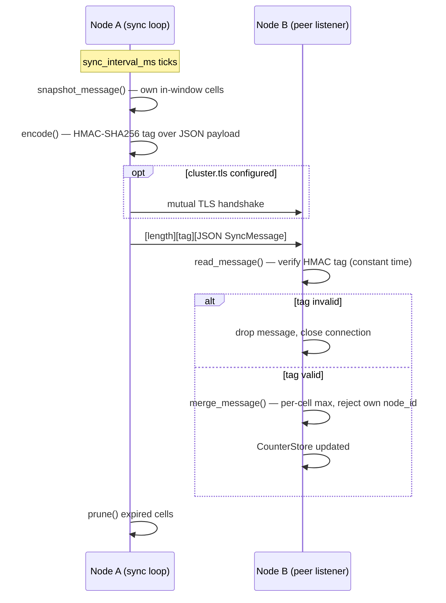

# Cluster Coordination

When `[cluster]` is configured, every node in the cluster gossips its own rate-limit counts to every peer, and each listener's admission decision combines its node-local [GCRA limiter](rate-limiting.md) with a cluster-wide budget derived from that gossiped state. Coordination is eventually consistent: a node only ever admits or denies against its own local view, which can briefly lag reality while gossip is in flight.

## The G-Counter CRDT

Cluster-wide counting is implemented by [`CounterStore`](../crates/lb-cluster/src/counters.rs), a Grow-Only Counter (G-Counter) CRDT. State is partitioned into cells addressed by `(key, node_id, epoch_second)`. Each cell has exactly one writer — the node named by `node_id` — and that node's own cell only ever grows.

Two directions matter, and they are not the same operation:

- **Within one node's cell**, counts are merged with `max`. A cell has one writer, so once its epoch second has passed its true value is fixed; `max` makes re-delivery, duplication, and out-of-order arrival of that node's own updates converge to the correct value regardless of message ordering.
- **Across nodes**, counts for the same key are **summed**. Consumption is additive: node A's five admissions and node B's three admissions both count against the same shared budget, for a total of eight.

Getting these two backwards is the classic bug this design exists to avoid: summing within a cell would let a duplicated message inflate a count, and maxing across nodes would let every node independently admit up to the full limit, multiplying it by the number of nodes.

The `max`-per-cell merge is idempotent, commutative, and associative, so the final state does not depend on delivery order, duplication, or partial delivery — properties exercised directly by property tests in [`coordinator.rs`](../crates/lb-cluster/src/coordinator.rs) and [`counters.rs`](../crates/lb-cluster/src/counters.rs).

### Windowing

`try_admit` sums a key's cells over the trailing `window_secs` seconds (inclusive of both ends: a 10-second window covers `[now - 9, now]`) and admits only if that sum is still below the configured limit; if so, it increments this node's own cell for the current second. The sum and the increment happen under one lock per key, so a single node never over-admits against its own view — the only slack in the system is gossip propagation delay to other nodes, covered below. `prune()` drops cells that have aged out of the window, which is also how a dead peer's counts disappear without any explicit expiry or health tracking: they simply stop being in-window.

## What is gossiped, and how often

Each node periodically pushes a [`SyncMessage`](../crates/lb-cluster/src/protocol.rs) — its own node id plus its own in-window cells, one entry per key — to every configured peer, then prunes its store. This runs on `cluster.sync_interval_ms` (default 200ms). A node never relays another node's cells, only its own: it is the sole authority for what it has admitted.

Each gossip round opens a fresh TCP connection to each peer, writes one framed message, and closes it, rather than maintaining a persistent connection with reconnect/backoff logic. This trades a handshake per round for eliminating that state entirely; at cluster scale and sub-second intervals the extra handshakes are negligible next to the traffic being balanced.

A node's own snapshot is capped so no single push message is unbounded:

- At most 5,000 `(epoch, count)` bucket entries (`MAX_SNAPSHOT_BUCKET_ENTRIES`) and at most an estimated 1 MiB of encoded payload (`MAX_SNAPSHOT_BYTES`, a quarter of the 4 MiB receive limit) per message, spread across as many keys as fit — at least one key is always included even if its own buckets alone exceed the cap.
- If a node tracks more in-window keys than fit in one message, successive pushes round-robin through the full key set via an internal cursor, so every key is eventually gossiped even under a snapshot that never covers everything at once.

## Message format and authentication

Every message is framed as `[4-byte big-endian length][32-byte HMAC-SHA256 tag][JSON-encoded SyncMessage]`, where the length covers the tag plus the JSON payload ([`protocol.rs`](../crates/lb-cluster/src/protocol.rs)). The tag is computed over the JSON payload with HMAC-SHA256 under the cluster's shared secret, and is verified — in constant time, via `verify_slice`, so a byte-wise comparison can never leak the expected tag through timing — before the payload is deserialized at all. A tag mismatch closes that connection with a "permission denied" error and drops the message; it never reaches the JSON parser or the counter store.

A message longer than 4 MiB is rejected by its length prefix before any allocation happens, and one shorter than 32 bytes (too short to hold a tag) is rejected outright. A single connection may carry several framed messages back to back.

The shared secret is mandatory whenever `[cluster]` is configured — configuration is rejected at startup unless exactly one of `shared_secret_env` or `shared_secret` is set:

```toml
[cluster]
node_id = "lb-1"
listen = "10.0.0.1:7000"
peers = ["10.0.0.2:7000", "10.0.0.3:7000"]
sync_interval_ms = 200   # optional, default shown
window_secs = 10          # optional, default shown
shared_secret_env = "LB_CLUSTER_SECRET"   # or shared_secret = "literal-value"
```

`shared_secret_env` names an environment variable read at startup (preferred, since config files end up in version control); `shared_secret` is a literal value, accepted for tests and constrained environments. Resolution happens outside config parsing (parsing stays a pure function of the config text), and a named-but-unset environment variable, or an empty resolved secret, fails startup immediately rather than silently running unauthenticated.

A message that claims the receiving node's own `node_id` is rejected as an `OwnNodeIdEcho` and logged at error level rather than merged: two nodes sharing a `node_id` would otherwise collide in the CRDT and silently under-count each other's admissions.

## Replay and clock-skew protection

`merge()` bounds one thing a peer's message cannot be trusted to bound itself: how far into the future a reported epoch second may be. Any cell timestamped more than `FUTURE_SKEW_TOLERANCE_SECS` (5 seconds) ahead of the receiving node's own clock is dropped rather than merged, and the drop is counted against a per-peer skew-rejection metric (`lb_cluster_future_skew_rejections_total`, labeled `peer`; see [`metrics-reference.md`](metrics-reference.md)).

The bound exists for a concrete reason: an unbounded future-dated cell would never be reclaimed by `prune()`, since pruning compares against whatever "now" is *at prune time* — a cell dated far enough ahead would simply never fall out of the window. Five seconds is deliberately generous enough to absorb ordinary, unsynchronized clock drift between real nodes (a legitimate peer a couple of seconds ahead is still merged normally) while still bounding how long a forged or badly-skewed timestamp can inflate memory.

The peer label on the skew-rejection metric is itself bounded: at most 64 distinct peer identities (`MAX_SKEW_PEER_LABELS`) get their own label value; a peer identity beyond that count is folded into a shared `"other"` label, so a spray of forged `node_id`s cannot grow the metric's label cardinality without limit.

## Bounds

- **`MAX_TRACKED_KEYS` (100,000).** A brand-new key is not admitted into the store once this many distinct keys are already tracked — mirroring the local GCRA's own `max_tracked_keys` cap, for the same reason: an attacker's key set must not be free to grow a node's memory without bound. Existing keys keep updating normally; only new ones are refused. Keys are reclaimed automatically as their cells age out of the window and `prune()` removes them.
- **Snapshot caps.** Covered above under gossip frequency: 5,000 bucket entries and about 1 MiB per outgoing message, round-robined across keys when the full set does not fit. The byte budget guarantees a message never exceeds the 4 MiB limit peers enforce on receipt; without it, enough long keys would make every message from a node oversized, and peers would reject all of its gossip.
- **Peer connections.** Each listener caps concurrent inbound connections from a single peer address (4 at a time) and closes a connection that has not completed one full authenticated frame within 30 seconds — a slow or hostile peer can occupy at most a small, fixed slice of the listener's resources.

## Peer channel mutual TLS

By default the peer channel is HMAC-authenticated but unencrypted: node ids and rate-limit counts are readable to anything that can observe the link. Setting `cluster.tls` requires every peer connection — inbound and outbound — to first complete a mutual TLS handshake before a single byte reaches the HMAC check:

```toml
[cluster.tls]
cert_file = "/etc/lb/peer.crt"
key_file = "/etc/lb/peer.key"
ca_file = "/etc/lb/peer-ca.crt"
handshake_timeout_ms = 5000   # optional, default shown
```

Gossip is symmetric — every node pushes to every peer and accepts pushes from every peer — so, unlike a listener's per-hostname certificate selection, each node presents exactly one identity ([`peer.rs`](../crates/lb-tls/src/peer.rs)) regardless of which role it is playing in a given connection. Trust is standard WebPKI, not a hand-rolled verifier: every peer's certificate must chain to the same `ca_file`, and each node's certificate must carry its own gossip bind IP as a Subject Alternative Name — the connecting side checks it via `ServerName::IpAddress`, the accepting side via the standard client-certificate verifier. A peer with no certificate, or one that chains to a different CA, never completes the handshake and therefore never reaches the HMAC layer at all; a connection that never finishes handshaking within `handshake_timeout_ms` is dropped. This is defense in depth under the HMAC check, not a replacement for it: enabling TLS does not make the shared secret optional.

## Partition behavior and convergence

A node keeps admitting locally against its own view for the entire duration of a partition — there is no attempt to halt traffic or detect a split. Two partitioned groups will each independently spend up to their own local view of the shared budget, so the combined total admitted across a full network partition can exceed the nominal cluster-wide limit; this is expected, not a bug, since the whole coordination model assumes a live (if lagging) gossip channel, and a full partition is outside that model by design.

Once connectivity is restored, ordinary gossip resumes and every node's local view converges to the same true total via the same `max`-per-cell merge described above — no reconciliation pass or special partition-recovery logic is needed, because the CRDT's merge is already order- and duplication-independent. This is validated directly by `lb-bench`'s cluster harness (`run_partition_scenario` in [`cluster_main.rs`](../crates/lb-bench/src/cluster_main.rs)), which partitions a 5-node cluster, bursts traffic on both sides, restores connectivity, and confirms every node's local view equals the true admitted total afterward.

## The admission decision

For a given request, the local GCRA and the cluster coordinator are checked in a fixed order (see [`request-lifecycle.md`](request-lifecycle.md)):

1. The local, node-only [GCRA limiter](rate-limiting.md) runs first, using the listener's configured rate-limit key (source IP, or a fixed-size hash of a header value — see [rate-limiting.md](rate-limiting.md#configuration)). If it denies, the request never reaches the cluster check at all — cluster coordination is deliberately skipped so a request that would be rejected anyway never consumes shared cluster state.
2. If the local check allows, and the listener has a cluster coordinator configured, `ListenerCoordinator::try_admit` is called with the *same* key. It namespaces the key by listener name (prefixed internally with a separator byte that cannot appear in an IP literal or header value), so two listeners rate-limiting the same client IP have independent cluster budgets, and delegates to the shared `CounterStore`'s windowed sum-and-increment described above.

The cluster-wide limit for a listener is derived, not separately configured: it is `ceil(rate_per_sec * window_secs)` — the listener's local per-node rate sustained over the whole cluster window. The local GCRA continues to shape bursts inside that sustained-rate ceiling; the cluster check only bounds the sustained total across every node.

A request denied at either stage gets the same `429 Too Many Requests` response with body `rate limit exceeded` (see [`rate-limiting.md`](rate-limiting.md#response-when-limited)); a cluster-level denial carries no `Retry-After` header, since the coordinator's admission check is a boolean, not a wait-time calculation.

### Sequence: one gossip round



### The documented overshoot bound

Because gossip is not instantaneous, a key's cluster-wide count can be transiently over-admitted before every node's view converges. [`convergence_over_admission_bound`](../crates/lb-cluster/src/coordinator.rs) gives the worst case:

```
per_node_burst = rate_per_sec * (sync_interval_ms / 1000)
bound          = ceil(per_node_burst * peer_count)
```

Each of the other `peer_count` nodes can independently admit up to `rate_per_sec * sync_interval` requests against a shared key before this node's next gossip round would observe them; the bound sums that worst case across every peer. `lb-server` exposes this per-listener as the `lb_ratelimit_cluster_convergence_bound` gauge (see [`metrics-reference.md`](metrics-reference.md)) so operators can see the theoretical slack for their own `rate_per_sec`/`sync_interval_ms`/peer-count combination.

This bound is tested empirically, not just asserted, by `lb-bench`'s cluster harness ([`cluster_main.rs`](../crates/lb-bench/src/cluster_main.rs)): real `ClusterNode`s gossip over real `tokio::net::TcpListener` sockets across a matrix of cluster sizes (3, 5, 10 nodes) and gossip intervals (100ms–5s), each running a synchronized paced burst against one shared key, and the harness compares the true converged total against `configured_limit + convergence_over_admission_bound(...)` for that combination. The bound is a model of steady-state gossip, not a hard guarantee: the reported results, including one combination that exceeded it marginally, are in [`benchmarks.md`](benchmarks.md).

## Failure modes

- **Dead peer.** No explicit health tracking exists for peers. A peer that stops responding simply stops contributing new cells; its last-known counts age out of the window on their own via `prune()`, exactly as if it had gone quiet gracefully.
- **Unreachable peer during a push.** A connection failure to one peer during a sync round does not affect delivery to any other peer, and does not stop the sync loop — each peer is pushed to independently within the round.
- **Malformed or unauthenticated frame.** Closes only that one connection; the peer listener keeps serving every other connection.
- **Duplicate `node_id`.** Detected and logged loudly (see above) rather than silently corrupting shared state; the message is not merged.
- **Full partition.** Covered above — each side keeps enforcing its own local view, and the combined total can exceed the nominal limit for the partition's duration; this is a known, accepted property of the model, not a defect.
