# Health Checking

This page covers every mechanism that removes a backend from, or restores it to, rotation: active HTTP/TCP probes, passive health checking from real traffic, the per-backend circuit breaker, statistical outlier detection, manual drain via the admin API, and how the resulting flags combine into eligibility. For the load-balancing strategies that pick among *eligible* backends, see [`load-balancing.md`](load-balancing.md). For the metrics each mechanism emits, see [`metrics-reference.md`](metrics-reference.md). For the full set of `[listeners.health_check]` fields, see [`configuration-reference.md`](configuration-reference.md).

## Eligibility

A backend is a candidate for a request only when four independent flags all agree. [`BackendPool`](../crates/lb-core/src/pool.rs) tracks, per backend:

- `active_healthy` — the active prober's verdict.
- `circuit_open` — the circuit breaker's verdict, mirrored into the pool once per request (see below).
- `outlier_ejected` — the outlier detector's verdict, if outlier detection is configured.
- `manually_drained` — an operator's drain request via the admin API.

A backend is eligible only if `active_healthy` is true and the other three are false. Each flag is independently observable (e.g. through `GET /backends`), because an operator needs to know *why* a backend is excluded — drained, circuit-tripped, and outlier-ejected are different operational facts even though all three produce the same routing outcome.

### Awaiting the first probe

A backend that joins a pool while the process is already serving — resolved by a later DNS poll, or added by a config reload — starts in an **awaiting-first-probe** state. It passes every flag above (nothing has failed yet), but it has not yet been confirmed by a health check. The state clears on the backend's first completed probe: a success makes it an ordinary eligible backend, a failure makes it unhealthy.

While any confirmed backend in the same pool is eligible, awaiting backends receive no traffic. If none is — at startup of a DNS listener, when DNS returns an entirely new set, or when every confirmed backend has failed — awaiting backends are used instead, rather than answering `503`. The race this closes is a newly discovered instance that accepts connections before it is ready: it is never selected until a probe says it is healthy, unless there is nothing better to send the request to. Backends listed in the configuration at startup are not held back, since nothing is serving yet.

`GET /backends` reports the state as `awaiting_first_probe`.

## Active health checks

One task, spawned by [`spawn_active_checker`](../crates/lb-healthcheck/src/active.rs), runs per backend. It ticks on `health_check.interval_ms`, runs the configured probe, and counts consecutive results. A healthy backend is marked unhealthy after `unhealthy_threshold` consecutive failures (default 3), and an unhealthy one is restored after `healthy_threshold` consecutive successes (default 2), so a single slow or dropped probe does not flap a backend in and out of rotation. A backend [awaiting its first probe](#awaiting-the-first-probe) is the exception: that first result decides its state immediately, since it has never been confirmed either way. What counts as a passing probe belongs entirely to the probe itself.

### HTTP probe

[`HttpProbe`](../crates/lb-healthcheck/src/probe.rs) issues a `GET` to `health_check.path` with a `health_check.timeout_ms` timeout. A 2xx status is healthy; any other status, a timeout, or a connection failure is unhealthy — there is no "no answer, assume fine" case.

### TCP probe

[`TcpConnectProbe`](../crates/lb-healthcheck/src/probe.rs) attempts a TCP connect within `timeout_ms`. For a plaintext listener that connect alone is the check. For a listener with `backend_tls` configured, a successful TCP connect is not sufficient: the probe also asks the listener's `OutboundTransport` to complete a TLS handshake over that connection, and only counts the backend healthy if both succeed. A backend with an expired or untrusted certificate would otherwise accept the TCP connection and still probe healthy.

### The shared-transport invariant

Both probes are built on the same `hyper_util` client (`HttpProbe`, via `Arc<dyn ProbeClient>`) or the same `OutboundTransport` (`TcpConnectProbe`) that `lb-proxy` uses to forward real traffic — not a second client built from equivalent-looking configuration. `lb-server` constructs one such client per listener and hands that identical value to both the proxy context and the probe.

This matters because trust roots, certificate verification, and DNS pinning are exactly the kind of configuration that is easy to duplicate incorrectly. A probe with its own TLS stack could verify a certificate that the data-plane client rejects (or vice versa), and the pool's health state would then describe a backend the proxy cannot actually reach — a passing probe with every real request failing. Sharing the transport makes that divergence structurally impossible rather than something to keep in sync by convention.

## Passive health checking

Independent of both the active prober and the circuit breaker's failure/success bookkeeping, every proxied HTTP request can also feed the circuit breaker two passive signals, evaluated in [`service.rs`](../crates/lb-proxy/src/service.rs) once a response comes back:

- **Latency.** If `health_check.unhealthy_latency_ms` is set, a response that took at least that long counts as a circuit-breaker failure even though it reached the client successfully. `CircuitBreaker::exceeds_latency_threshold` always returns `false` when this is unset.
- **Concurrency.** If `health_check.unhealthy_request_count` is set, a backend already carrying at least that many in-flight requests/connections (`BackendPool::active_count`) counts its next *completed* request as a failure, regardless of that request's own latency or status. `exceeds_concurrency_threshold` is likewise always `false` when unset.

Either condition routes into `record_failure()`/`record_success()` exactly like an active-probe-independent transport failure would, so it participates in the same threshold/cooldown/flap-backoff state machine described below — a slow-but-successful response is a distinct failure mode from a connection error, but both trip the same breaker. A connection or timeout failure on the request path (`ForwardError`) always calls `record_failure()` directly, with no threshold configuration to enable it.

## Circuit breaker

The circuit breaker ([`circuit_breaker.rs`](../crates/lb-healthcheck/src/circuit_breaker.rs)) is driven by request outcomes — active-probe results never touch it directly. It is implemented without a mutex: every field is an atomic, because `state()` is evaluated once per backend on every proxied request, and a lock there would serialize otherwise-independent worker threads across a shared listener.

### States and transitions

```mermaid
stateDiagram-v2
    [*] --> Closed
    Closed --> Open: consecutive failures reach failure_threshold
    Open --> HalfOpen: effective cooldown elapses (evaluated lazily on state())
    HalfOpen --> Closed: half_open_successes_required consecutive successes
    HalfOpen --> Open: any failure
    Open --> Open: failure (no-op; already open)
```

- **Closed** — requests are forwarded normally. `record_failure()` increments a consecutive-failure counter; at `failure_threshold` the breaker trips to Open.
- **Open** — the backend is excluded from routing. `record_failure()` is a no-op in this state. `record_success()` is also a no-op: a stale success (e.g. from a request that was in flight before the trip) must not cancel the cooldown.
- **HalfOpen** — reached once the time since the trip exceeds the *effective* cooldown (see below). `record_success()` increments a consecutive-success counter; at `half_open_successes_required` the breaker closes and the failure/success counters reset. Any `record_failure()` while HalfOpen re-trips to Open immediately and restarts the cooldown timer, discarding any partial success streak.

The Open → HalfOpen transition is evaluated lazily, inside `state()`/`is_open()`, by comparing the clock against the timestamp the breaker opened. Nothing pushes this transition on a timer; the request-handling loop in `service.rs` calls `is_open()` once per backend per request specifically to give this evaluation a chance to run and to refresh `BackendPool`'s cached `circuit_open` flag. Without that per-request refresh, a tripped backend would receive no traffic, `is_open()` would never be called again for it, and it would stay excluded forever regardless of how much time passed.

### Flap backoff

Each re-trip into Open, since the backend last stayed Closed for at least `flap_streak_reset_ms`, multiplies the plain `cooldown_ms` by `flap_backoff_multiplier`, raised to one less than the current streak length, capped at `max_flap_cooldown_ms`. A first-ever trip (streak length 1) always uses the unscaled cooldown. A long enough healthy stretch (`flap_streak_reset_ms`) resets the streak, so an isolated trip long after recovery is not penalized as though it were a continuation of old flapping. Defaults (`flap_backoff_multiplier = 1.0`, `max_flap_cooldown_ms` effectively unbounded) reduce this to a fixed cooldown, matching pre-existing behavior.

### Concurrency guarantees

State transitions use `compare_exchange` rather than read-then-write: a losing thread's transition is redundant (another thread already made the same change) and is simply dropped rather than retried. This keeps `record_failure`/`record_success`/`state()` callable from many worker threads concurrently — proven by the crate's own concurrent test suite — without a lock ever serializing the request path.

## Outlier detection

[`OutlierDetector`](../crates/lb-healthcheck/src/outlier.rs) compares a pool's backends statistically against each other, catching a failure mode neither the active probe nor the (absolute-threshold) circuit breaker sees on its own: a backend that is reachable and passes its health-check path, but whose real responses are disproportionately failing relative to its peers.

Enabled per pool via `health_check.outlier_detection`; `None` (the default) spawns no background task and does no per-request bookkeeping.

### Detection signal

Every proxied request records a boolean outcome per backend: for HTTP, `!status.is_server_error()` (a 5xx counts as a failure even though the transport call itself succeeded — the same status-based success-rate definition Envoy's outlier detection uses); for a transport-level failure (connect/timeout), an unconditional failure. On a fixed recompute interval, `recompute()`:

1. Snapshots and resets each backend's success/total counters.
2. Filters to backends with at least `min_volume` recorded outcomes this round.
3. Only proceeds ("activates") if at least `min_hosts` backends met that bar; otherwise nothing is judged this round.
4. Computes the mean and standard deviation of the qualifying backends' success rates, and flags any backend whose rate falls more than `stddev_factor` standard deviations below the mean.

### Ejection duration

A flagged backend is ejected for a fixed number of recompute rounds, `eject_ticks`, decremented each round it remains flagged (or re-armed to a fresh `eject_ticks` if it is flagged again in a later round — "still bad on probation" restarts the countdown rather than extending the same one). `eject_ticks` is not a separate config field: [`build_outlier_detector`](../crates/lb-server/src/wiring.rs) derives it from the pool's own `cooldown_ms` and `interval_ms` (`cooldown_ms` divided by `interval_ms`, rounded up, floored at 1), so an ejected backend stays out for roughly the same duration the circuit breaker's own cooldown already uses, and outlier detection needs no cooldown field of its own. There is no growth analogous to the circuit breaker's flap backoff — each ejection uses the same `eject_ticks` count regardless of how many times a backend has been flagged before.

### Ejection ceiling

Both the circuit breaker and outlier detection eject through the same [`BackendPool::set_circuit_open`](../crates/lb-core/src/pool.rs)/`set_outlier_ejected` calls, which enforce an optional shared ceiling: `health_check.max_ejected_fraction`. Before admitting a *new* ejection (from either mechanism), the pool counts how many backends are already excluded by either flag; if adding one more would push that fraction over the configured limit, the new ejection is refused and the backend stays eligible. The ceiling only blocks new ejections — it never blocks recovery (clearing a flag always succeeds), and it never double-counts a backend that is already ejected. The count-decide-store sequence for a new ejection runs under a per-pool lock, so concurrent trips on different request threads (the normal shape of a correlated failure) and the outlier detector's recompute task cannot each pass the check and collectively exceed the ceiling. Recoveries, and refreshes of a backend that is already ejected, take no lock.

The rationale is that both mechanisms react to symptoms that can correlate across a whole pool at once — a shared dependency failing, a bad deploy — and an uncoordinated ceiling-less pool can eject every backend simultaneously, which is a worse outcome than continuing to serve some traffic through backends that are themselves unhealthy. `max_ejected_fraction` trades "never route to a known-bad backend" for "never route to *no* backend," at an operator-chosen ratio.

## Manual drain

The admin API exposes two endpoints, implemented in [`admin_backends.rs`](../crates/lb-server/src/admin_backends.rs):

- `POST /backends/{listener}/{backend_id}/drain` sets `manually_drained` true.
- `POST /backends/{listener}/{backend_id}/undrain` sets it false.

`GET /backends` lists every listener's backends (default pool, plus each `[[listeners.routes]]` and `[[listeners.canary]]` pool) with their address, all four flags, `awaiting_first_probe`, overall eligibility, and in-flight connection count.

`manually_drained` is a flag independent of `active_healthy`, deliberately not folded into it: the active checker writes `active_healthy` on its own probe schedule, oblivious to an operator's drain request, so if a drain shared that flag the very next successful probe would silently undo it. A drain removes the backend from `eligible_backends()` for *new* traffic without touching connections already in flight and without forgetting the backend the way removing it from config would (which requires a reload to reintroduce). It composes with the other three flags exactly as eligibility requires: draining a backend that is also circuit-open or outlier-ejected changes nothing observable until every excluding flag clears.

## DNS churn and config reload

### DNS-discovered backends

A `dns_discovery` listener's poller ([`dns.rs`](../crates/lb-server/src/dns.rs)) resolves its configured name on `poll_interval_secs` (default 10s). On each successful poll it brings every piece of per-backend state into line with the resolved set, so a DNS-discovered backend is protected exactly like a static one:

1. Each newly resolved backend gets a circuit breaker built from the listener's `health_check` settings (so passive latency and concurrency thresholds apply too), its per-backend metrics, and — if configured — outlier-detection tracking. This happens before the backend is added to the pool, so no request can select a backend that has no breaker yet.
2. `BackendPool::apply_resolved` updates the pool. A new backend enters in the [awaiting-first-probe](#awaiting-the-first-probe) state.
3. A real `spawn_active_checker` task is started for every new backend, and the checker of every departed backend is aborted.

A backend that disappears from DNS loses its breaker, outlier tracking and — for a TLS listener — its cached per-backend client, and its per-backend metric series are removed from `/metrics`, so autoscaling churn does not accumulate stale series. A backend that persists across a poll keeps its breaker instance and every flag (`active_healthy`, `circuit_open`, `outlier_ejected`, `manually_drained`, awaiting state) and its in-flight count. A failed DNS lookup logs a warning and leaves the current backend set, and all of its state, untouched.

### Config reload

A reload that changes a listener's configuration (`crates/lb-server/src/reload.rs`, triggered by SIGHUP) rebuilds that listener's `BackendPool` and circuit breakers. Live state is carried forward from the running listener via [`PreviousListenerState`](../crates/lb-server/src/wiring.rs), captured just before the rebuild, so an unrelated change does not return known-bad backends to rotation:

- Every backend's `manually_drained` flag.
- Every backend's `active_healthy` verdict and awaiting-first-probe state. A backend that failed its last probe stays out of rotation until a probe succeeds.
- Every circuit breaker's full snapshot (state, failure/success counters, flap streak, cooldown clock), used to reconstruct each breaker via `CircuitBreaker::from_snapshot` with the *new* config's thresholds/cooldowns but the *carried-over* live state.
- For a `dns_discovery` listener whose `[listeners.dns_discovery]` settings did not change, the currently resolved backend set itself, so the rebuilt listener keeps serving the same backends, with their health and breakers, until its next successful poll. Their health checks restart immediately, so they stay under active checking even while DNS lookups are failing.

A backend that is new in the reloaded configuration starts [awaiting its first probe](#awaiting-the-first-probe).

`outlier_ejected` is deliberately **not** carried: the outlier detector is rebuilt with the pool, and an ejection it did not make itself could never be lifted by its recompute rounds. An ejected backend therefore returns to rotation on reload and is re-evaluated from fresh traffic; if it is still failing, its carried-over circuit breaker and the next recompute round exclude it again.
