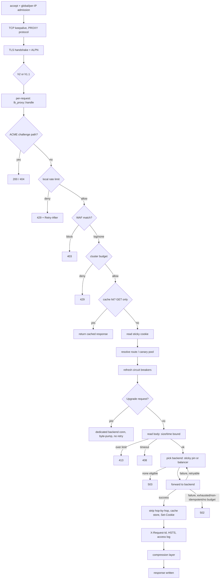

# Request Lifecycle

This page traces the exact, ordered path a connection takes through the load balancer today, from `accept()` to response or close, for both the HTTP (L7) listener and the TCP (L4) listener. Each step names what can reject or short-circuit it and with which status (HTTP) or outcome (TCP). Configuration knobs are documented in [`configuration-reference.md`](configuration-reference.md); the mechanics behind individual features (load balancing algorithms, health checking, rate limiting, TLS, edge hardening, HTTP features) live on their own pages and are linked from the relevant step rather than repeated here.

## HTTP request path

Steps 1-6 are shared by every connection on an HTTP listener, before any request is parsed. Steps 7 onward run once per request (HTTP/1.1 keep-alive and HTTP/2 multiplexing mean steps 1-6 run once per connection but 7+ run repeatedly on it).

1. **Global admission.** The accept loop (`serve_listener` in [`lib.rs`](../crates/lb-server/src/lib.rs)) acquires a permit from the listener's global `Semaphore` *before* calling `accept()`. When the permit pool is exhausted, the loop simply stops calling `accept()` for that listener; the kernel backlog absorbs and eventually refuses new connections. No permit, no accept.
2. **`accept()`.** A transient accept error (e.g. descriptor exhaustion) is logged and the loop continues; it does not kill the listener.
3. **Per-IP admission.** `PerIpLimiter::try_acquire` ([`limits.rs`](../crates/lb-server/src/limits.rs)) checks the accepted peer's address against its connection cap. Over the cap: the socket is dropped immediately, silently, before any bytes are read. Both this guard and the global permit are held for the entire lifetime of the connection, including the TLS handshake.
4. **TCP keepalive.** If the listener configures `[listeners.client_tcp_keepalive]`, `SO_KEEPALIVE` and its time/interval/retry settings are applied to the accepted socket. Advisory only — a failure to apply it is logged and does not close the connection.
5. **PROXY protocol (optional).** If the listener has `proxy_protocol` enabled, `proxy_protocol::read_header` ([`proxy_protocol.rs`](../crates/lb-server/src/proxy_protocol.rs)) reads a v1 or v2 header off the front of the stream before anything else touches it, bounded by `proxy_protocol_timeout`. A `LOCAL`/`UNKNOWN` header (no real client) falls back to the raw TCP peer. A malformed header or a timeout: the connection is dropped with no response — this path is a hard trust boundary, not a fallback path.
6. **TLS handshake and ALPN (TLS listeners only).** The handshake runs inside the per-connection task, not the accept loop, so a slow client stalls only its own task. Both admission guards above stay held across it. Outcomes: success (ALPN protocol read off the concrete `TlsStream` before it is type-erased — this is what lets protocol dispatch skip any preface sniffing), handshake timeout (drop), or handshake failure (drop; no alert is sent, since no TLS session exists yet). See [`tls.md`](tls.md) for certificate selection, ALPN configuration and reload behavior.

Steps 1-6 apply identically to a listener of type `Tcp`; see [TCP session path](#tcp-session-path) below for what happens after them on that listener type.

7. **Config snapshot load.** `drive()` ([`lib.rs`](../crates/lb-server/src/lib.rs)) loads the current `ArcSwap` snapshot of the listener's routing/backend/rate-limit config for this connection. A connection keeps the snapshot it loaded for its whole life; a config reload (SIGHUP) only affects connections accepted after it, so a long-lived HTTP/1.1 keep-alive or HTTP/2 connection keeps using its original backend set until the client reconnects. See [`operations.md`](operations.md).
8. **Protocol dispatch.** Negotiated ALPN (`h2` vs not) selects the builder:
   - **HTTP/2:** `hyper::server::conn::http2::Builder`, configured with `max_concurrent_streams`, Rapid Reset mitigations (`max_pending_accept_reset_streams`, `max_local_error_reset_streams`), HPACK/frame size caps, and PING keepalive. The stream is wrapped in `FirstByteDeadline` ([`first_byte.rs`](../crates/lb-server/src/first_byte.rs)), which times out a client that completes ALPN as `h2` and then never sends a preface — hyper's own PING keepalive only arms after the preface arrives, so without this the connection (and its admission guards) would be held forever.
   - **HTTP/1.1:** `hyper::server::conn::http1::Builder` with `header_read_timeout` (slowloris defense on the request head) and `.with_upgrades()` — required for the WebSocket/Upgrade path (step 17) to receive the raw connection after a `101`.
   Both are wrapped, before protocol selection, in `WriteIdleTimeout` ([`write_timeout.rs`](../crates/lb-server/src/write_timeout.rs)): a continuous idle timeout on the *write* side, resetting on every write that makes progress, so a client that stops reading its response cannot hold the connection (and its admission guards) open indefinitely.
   Both builders serve a `tower::ServiceBuilder` stack: a `CompressionLayer` (see step 21) wrapping `lb_proxy::handle` (step 9 onward).

9. **ACME HTTP-01 challenge short-circuit.** Before rate limiting, WAF, or anything else, `handle_inner` ([`service.rs`](../crates/lb-proxy/src/service.rs)) checks whether the path starts with `/.well-known/acme-challenge/`. If the listener has an ACME challenge store configured and the token is known: `200` with the key authorization body. Otherwise (store configured but token unknown): `404`. If no store is configured, this check does nothing and the request falls through.
10. **Local rate limit.** The rate-limit key is extracted from the peer IP or a configured header ([`rate-limiting.md`](rate-limiting.md)). A GCRA check runs in-process; a deny returns `429 Too Many Requests` with a `Retry-After` header computed from the token refill time.
11. **WAF.** If `[listeners.waf]` is configured, the request's path+query (and, if `inspect_headers` is set, `User-Agent`/`Referer`/`Cookie`) are checked against a fixed set of SQL-injection/XSS/path-traversal substring rules ([`waf.rs`](../crates/lb-proxy/src/waf.rs)). In `Block` mode a match returns `403 Forbidden`; in `Log` mode the match is recorded in metrics and the request proceeds unchanged. This runs after the free local rate limiter but before any state shared across the cluster.
12. **Cluster-wide rate limit.** Only reached if the local check passed. If `[cluster]` is configured, `ClusterCoordinator::try_admit` is checked; a deny returns `429 Too Many Requests` with no `Retry-After` (the cluster has no notion of a per-node refill time). See [`cluster-coordination.md`](cluster-coordination.md).
13. **Cache lookup.** For a `GET` request without an `Authorization` header that is not an upgrade handshake, if `[listeners.cache]` is configured, the key is built from method+host+path+query+normalized `Accept-Encoding` ([`cache.rs`](../crates/lb-proxy/src/cache.rs)) and looked up. A hit returns the stored status/headers/body immediately — no route resolution, no circuit-breaker refresh, no backend is ever picked. A miss falls through and is recorded as such. See [`http-features.md`](http-features.md) for cache-key composition and `Cache-Control` handling.
14. **Sticky cookie read.** If `[listeners.sticky]` is configured, the pin cookie is read and decoded into a candidate `BackendId` ([`sticky.rs`](../crates/lb-proxy/src/sticky.rs)). Eligibility is not checked yet — that happens where the pin is consumed (steps 15 and 19).
15. **Route / canary pool resolution.** `resolve_route` checks `[[listeners.routes]]` in declaration order (path-prefix and/or Host match); the first match wins outright and its pool/balancer/outlier are used. If nothing matches and `[[listeners.canary]]` pools are configured, the sticky pin (step 14) is checked first: if it names a backend in the default pool or in one of the canary pools, that pool is used directly with no roll. Otherwise a deterministic weighted roll (an atomic cursor mod 100) picks between the default pool and the canary pools. If no routes and no canary pools are configured, the listener's single default pool/balancer is used. See [`load-balancing.md`](load-balancing.md).
16. **Circuit-breaker refresh.** For every backend in the *resolved* pool, the breaker's `Open -> HalfOpen` transition (evaluated lazily inside `is_open()`) is polled once and the pool's cached `circuit_open` flag and the backend's `circuit_state` metric are updated. Without this, a backend that trips its breaker would stay excluded from `eligible_backends()` forever, since nothing else re-checks `is_open()`. See [`health-checking.md`](health-checking.md).
17. **WebSocket/Upgrade branch.** If the request carries a `Connection: Upgrade` token and a non-empty `Upgrade` header, control passes to `upgrade::handle_upgrade` ([`upgrade.rs`](../crates/lb-proxy/src/upgrade.rs)), which bypasses the cache, sticky-cookie machinery above and the retry loop below entirely and returns directly (see [step 20](#websocket-branch-detail)). Every other request continues to step 18.
18. **Body read.** The request body is read via `read_bounded`, bounded by `max_request_body_bytes` and `body_read_timeout`. Over the size cap: `413 Payload Too Large`. Timeout: `408 Request Timeout`. A size limit alone is not a timeout — this is why both are enforced together.
19. **Backend selection and forward (attempt loop, at most two attempts).**
    - On the first attempt, a sticky pin from step 14 is used if it names a backend still eligible in the resolved pool; otherwise (and on the second attempt, unconditionally) `balancer.pick()` selects one. No eligible backend at all: `503 Service Unavailable`.
    - `build_outbound_request` rewrites the request for the backend (scheme/authority from the backend's TLS config, hop-by-hop headers stripped per [RFC 7230 §6.1](https://www.rfc-editor.org/rfc/rfc7230#section-6.1): `Connection` and whatever it names, `Keep-Alive`, `Proxy-Authenticate`, `Proxy-Authorization`, `Proxy-Connection`, `TE`, `Trailer`, `Transfer-Encoding`, `Upgrade`). A TLS backend with no configured `server_name`: `502 Bad Gateway`, not retried (every backend on this listener would fail the same way, and falling back to plaintext is never acceptable).
    - The request is sent through `forward()` ([`forward.rs`](../crates/lb-proxy/src/forward.rs)) under `forward_timeout`, using either the listener's pooled client or a per-backend client (DNS-discovered backends sharing a `server_name` under backend TLS — [`per_backend.rs`](../crates/lb-proxy/src/per_backend.rs)).
20. **On a successful forward:** the circuit breaker records success/failure from status and from passive latency/concurrency thresholds (independent of the outlier detector's status-based success rate — both feed [`health-checking.md`](health-checking.md)); the outlier detector records the outcome; hop-by-hop headers are stripped from the *response*; if the response is cacheable (`GET`, `200`, a `Content-Length` within the entry cap, and `Cache-Control` not forbidding it — see [`http-features.md`](http-features.md)) the body is collected under `body_read_timeout` and stored before the sticky `Set-Cookie` is added, so a cached entry never carries one client's pin; the sticky cookie (if configured) is (re)set on every successful response, pinning or renewing the pin; the response is returned. A backend failure records the same breaker/outlier signals as a failure, then:
    - if this was the second attempt, the loop stops and returns `502 Bad Gateway`;
    - if the method is not idempotent (anything outside `GET/HEAD/PUT/DELETE/OPTIONS/TRACE`), the loop stops and returns `502` — the request body has already been fully read into memory, so a retry is safe to *send*, but not safe to have side effects twice;
    - if a retry budget (`[listeners.retry_budget]`, a GCRA keyed on a fixed budget key) is configured and denies, the loop stops and returns `502`;
    - otherwise the loop retries once, picking again via `balancer.pick()` — the failed backend's circuit breaker was just updated, so it is typically excluded from the retry's eligible set.

Step 17's upgrade branch: it picks a backend the same way (no retry on failure — `502`/`503` on connect failure or backend refusal), dials a dedicated, non-pooled HTTP/1.1 connection to it (the pooled client cannot be reused for a socket that is about to stop being HTTP), forwards the handshake with headers copied verbatim (hop-by-hop stripping would break `Connection`/`Upgrade`/`Sec-WebSocket-*`), and — only on a `101` from the backend — hands both sides off to a background byte-pump under `websocket_idle_timeout`. A backend that answers with anything other than `101` becomes an ordinary (non-upgraded) response, hop-by-hop stripped normally.

21. **Response post-processing (`handle`, wrapping `handle_inner`).** Once `handle_inner` returns: status-class and request-duration metrics are recorded; an `X-Request-Id` (server-generated, never taken from a client header) is injected; if the listener terminates TLS and `hsts_max_age_secs` is configured, `Strict-Transport-Security` is added to *every* response from that listener, including `429`s and `503`s; the request is optionally written to the access log under deterministic 1-in-N sampling.
22. **Compression.** Applied by the `tower_http::CompressionLayer` installed in step 8, outside `handle` entirely — it negotiates against the client's `Accept-Encoding` and skips bodies that are already encoded or below its size floor. This happens last, as bytes are written to the wire, and applies uniformly to proxied and cached responses alike.

## TCP session path

Steps 1-6 above (admission, keepalive, PROXY protocol, TLS handshake) are identical for a `Tcp`-type listener; `drive()` dispatches to `lb_tcp::handle_connection` ([`session.rs`](../crates/lb-tcp/src/session.rs)) instead of the HTTP service afterward. From there:

1. **Local rate limit.** The peer IP is the only available key (no headers at L4). A deny closes the connection immediately with no data sent — there is no L4 mechanism to explain a rejection.
2. **Cluster-wide rate limit.** Same ordering as HTTP: checked only after the local limiter allows the connection. A deny closes the connection the same way.
3. **Circuit-breaker refresh.** Identical mechanism to the HTTP path's step 16, run once per session (L4 has no per-request boundary).
4. **Backend selection and connect (attempt loop, at most two attempts).** `balancer.pick()` selects a backend; no eligible backend closes the connection. `establish()` dials the backend under `connect_timeout` and, if the listener re-encrypts, performs the outbound TLS handshake (`OutboundTransport::wrap`) — a refused connect, a connect timeout, and a handshake failure are all treated as the same outcome: the backend did not answer. Success records latency/outlier/breaker signals using the same passive latency/concurrency thresholds as the HTTP path. Failure records failure and, on the first attempt, retries once with a fresh `pick()` (as on the HTTP path, the failed backend is excluded only if the failure opened its circuit) — safe here in a way an HTTP retry only partially is, because no client byte has been read yet. A second failure closes the connection.
5. **Bidirectional pump.** The client and backend streams are each split into read/write halves and two `pump()` tasks ([`pump.rs`](../crates/lb-tcp/src/pump.rs)) run under `tokio::try_join!`, sharing one `IdleTracker` so idle time resets on activity in *either* direction. `try_join!` rather than `select!` is deliberate: each direction must finish on its own, or a protocol that half-closes one direction while still reading the other would be broken by tearing down the whole connection on the first EOF. On EOF, the writer is shut down, propagating the half-close to the peer.
6. **Outcome.** `Completed { bytes_to_backend, bytes_to_client }` on a clean finish in both directions, or `Aborted` if a direction errors or exceeds the idle timeout.

## What this page does not cover

- Configuration syntax for any feature named above — see [`configuration-reference.md`](configuration-reference.md).
- Load-balancing algorithm selection (round robin, least connections, latency-aware, etc.) — see [`load-balancing.md`](load-balancing.md).
- Circuit breaker and outlier detector thresholds/state machine — see [`health-checking.md`](health-checking.md).
- GCRA rate-limit semantics and configuration — see [`rate-limiting.md`](rate-limiting.md).
- Cluster admission/coordination protocol — see [`cluster-coordination.md`](cluster-coordination.md).
- TLS certificate selection, ALPN configuration and reload — see [`tls.md`](tls.md).
- WAF rule catalogue, PROXY protocol trust model, per-IP/global connection limits — see [`edge-hardening.md`](edge-hardening.md).
- Response cache key/TTL rules, compression negotiation, WebSocket upgrade configuration — see [`http-features.md`](http-features.md).
- Metric names emitted at each step — see [`metrics-reference.md`](metrics-reference.md).
- Config hot-reload and its effect on in-flight vs. new connections — see [`operations.md`](operations.md).
