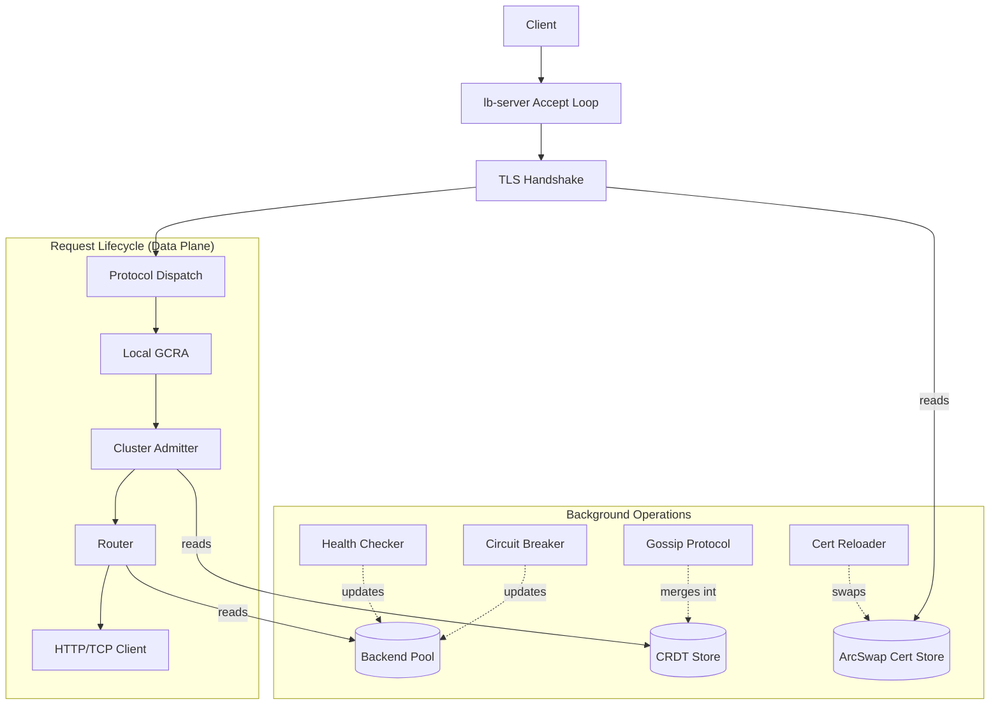

# Architecture Overview

The system is organized into a single binary (`lb-server`) and ten narrow libraries. The fundamental architectural principle is strict separation between the data plane (the request path) and the background control plane (health checks, clustering, configuration).

## Crate Map

| Crate | Role | Key types |
|---|---|---|
| **lb-core** | Shared trait definitions and configuration | `Config`, `Backend`, `BackendPool`, `LoadBalancer`, `RateLimiter` |
| **lb-server** | Binary entry point, component wiring, accept loop | `ListenerRuntime`, `WiredApp`, `ConnectionLimits` |
| **lb-proxy** | L7 HTTP forwarding | `ProxyContext`, `PinnedResolver` |
| **lb-tcp** | L4 TCP session proxying | `TcpContext` |
| **lb-balancer** | Load-balancing algorithms | `RoundRobin` |
| **lb-ratelimit** | Per-key rate limiter | `Gcra` |
| **lb-healthcheck** | Active health checks, circuit breaker | `HttpProbe`, `CircuitBreaker` |
| **lb-cluster** | Distributed rate limiting via CRDT | `ClusterNode`, `ListenerCoordinator`, `CounterStore` |
| **lb-tls** | TLS termination and backend re-encryption | `TlsAcceptor`, `BackendConnector`, `SniResolver` |
| **lb-metrics** | Prometheus metrics | `Metrics`, `ListenerMetrics` |

## Dependency Graph and Trait Boundaries

Dependencies flow strictly downward. `lb-core` depends on nothing inside the workspace. 

The data-plane crates (`lb-proxy`, `lb-tcp`) never import each other, and crucially, they never import `lb-tls` or `lb-healthcheck`. 

To achieve this, the system relies on trait objects (Dependency Injection).

```rust
// lb-core/src/traits.rs
pub trait LoadBalancer: Send + Sync {
    fn pick(&self, pool: &BackendPool) -> Option<BackendId>;
}

pub trait OutboundTransport: Send + Sync {
    fn wrap(&self, stream: Box<dyn ProxyStream>, server_name: String, timeout: Duration) -> WrapFuture<'_>;
}
```

The `lb-server` crate knows about all concrete types. During startup, it builds a `RoundRobin` balancer, a `BackendTlsTransport`, and a `Gcra` rate limiter. It wraps these in `Arc<dyn Trait>` and hands them to the data plane contexts (`TcpContext`, `ProxyContext`). 

When a TCP session wants to connect to a backend, it asks its `OutboundTransport` to wrap the stream. The TCP crate does not need to know that `rustls` exists or how SNI is resolved.

## Request Path vs. Control Path

To maintain high throughput, the request path must not block on locks or perform complex state evaluations.

### The Control Path
Background tasks manage system state independently of traffic:
- **Health Checkers:** Wake up on timers, probe backends, and write boolean flags (`active_healthy`) to the `BackendPool`.
- **Cluster Sync:** The gossip loop wakes up every 500ms, sends local counts to peers, receives peer counts, and merges them into a `DashMap`.
- **TLS Reloaders:** Wake up every hour, check disk timestamps, and swap certificates atomically.

### The Request Path
When a request arrives, it only performs fast, non-blocking reads of this prepared state:
- **Routing:** Reads the cached `circuit_open` and `active_healthy` flags from the `BackendPool` to select a backend. It does not perform health checks.
- **Rate Limiting:** Performs a GCRA calculation (math + `DashMap` lookup) and reads the aggregated cluster total. It does not initiate gossip.
- **TLS:** Uses the currently active certificate from the `ArcSwap`. It does not hit the disk.

This separation ensures that a network partition among peers, a slow backend health check, or a slow disk during a cert reload cannot pause traffic handling.

## Component Relationships


